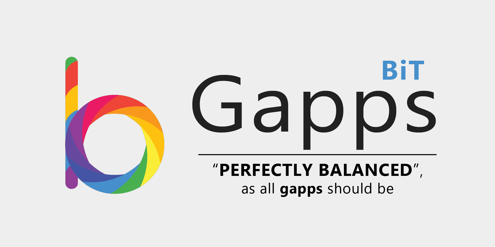

## BiTGApps Custom Patch

Custom addon patch for main BiTGApps package.

## Important links

XDA Posts

* `[ARM64]Android Q XDA Thread` [Click Here](https://forum.xda-developers.com/android/software/arm64-bitgapps-q-10-0-0-t3968500)

* `[ARM64]Pie XDA Thread` [Click Here](https://forum.xda-developers.com/android/software/arm64-bitgapps-pie-9-0-0-t3828515)

* `[ARM64]Oreo XDA Thread` [Click Here](https://forum.xda-developers.com/android/software/arm64-bitgapps-oreo-8-1-0-t3788794)

* `[ARM64]Nougat XDA Thread` [Click Here](https://forum.xda-developers.com/android/software/arm64-bitgapps-nougat-7-1-x-t3795570)

* `[ARM]Android Q XDA Thread` [Click Here](https://forum.xda-developers.com/android/software/arm-bitgapps-q-10-0-0-t3968827)

* `[ARM]AIO XDA Thread` [Click Here](https://forum.xda-developers.com/android/software/arm-bitgapps-variants-t3959373/post80105739#post80105739)

Telegram

* `Group` [Click Here](https://t.me/bitgapps_official)

* `Channel` [Click Here](https://t.me/bitgapps_downloads_official)

## Support Android Version

* Android Q (10.0.0) `ARM & ARM64`

* Pie (9.0.0) `ARM & ARM64`

* Oreo (8.1.0) `ARM64`

* Nougat (7.1.2) `ARM64`

## Android ARCH Support

* arm & arm64

## Addon Support

* Google Assistant

## Support Partition Type

* A-only and A/B

## Troubleshoot

Installation ended up with error message.

* Check Github issue section for arch arm64 [Click Here](https://github.com/TheHitMan7/BiTGApps-ARM64/issues/6).

* Check Github issue section for arch arm [Click Here](https://github.com/TheHitMan7/BiTGApps-ARM32/issues/1).
